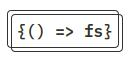
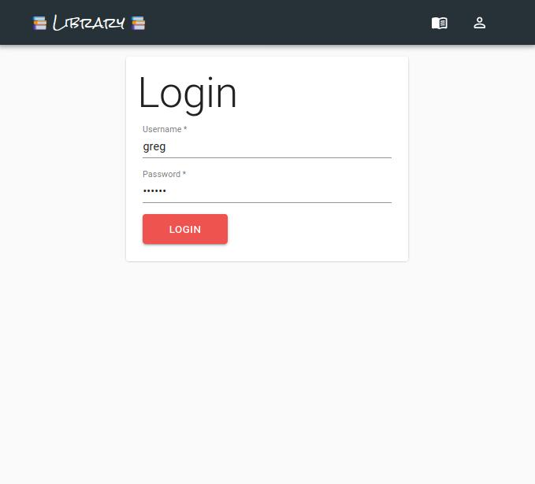
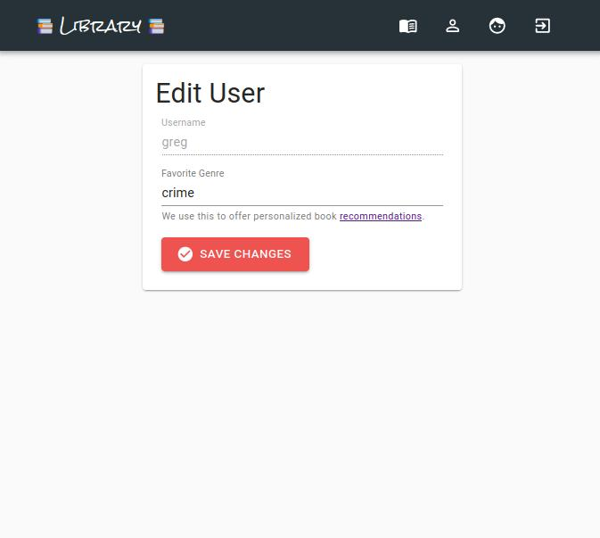
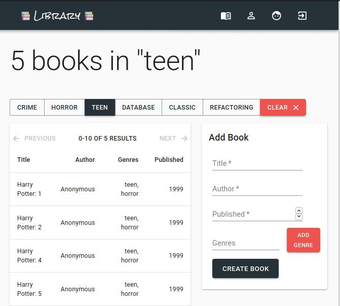
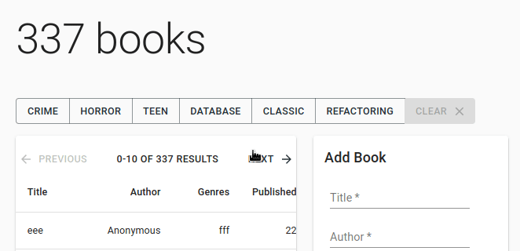
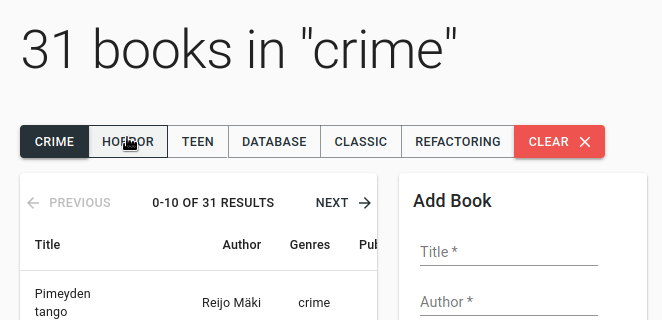

<div align="center">



</div>
<h1 align="center">React + GraphQL + Apollo Client - Library App</h1>

## Purpose

This is a toy library app built on ReactJS, GraphQL and ApolloClient.

Inspiration and resources for the project from <a href="https://fullstackopen.com/en">FullStackOpen</a>.

## Usage

Clone the repository, install the depnedancies run `$ npm run dev` to see the application in action.

## Pages

You have the following pages to explore throughout the application:

- Recommendations Page - A personalized list of recommended books based on your favorite genre.
- Authors Page - A list of all the authors added and a form to change born date!
- Books Page - A list of all the books added and form to add more!
- Edit User Page - A simple form for changing a users favorite genre (used for recommendations)
- Login Page - A simple login page (password is "<b><i>secred</i></b>")

### Login Page



The application requires you to login to do anything.

#### Authorization

The authorization system is simple - when the LoginForm is submitted, the `login({ variables: { username, password } });` mutation returns a token or null.

Next, the application uses `setContext` from apollo-link-context to add an Authorization token to all future Request's this user may make.

The EditAuthor, AddBook and EditUser components all require an authorization token to mutate data.

The password is <b><i>secred</i></b> so dont tell anytime!

### Recommendations Page


The recommendations page is a simple graphQL query which takes a user's `favoriteGenre` and returns books in that genre.

#### Get the user

First the application uses the `GET_USER` query to get the current user.

```
export const GET_USER = gql`
  query {
    me {
      username
      favoriteGenre
    }
  }
`;
```

#### Get Recommendations

After getting the user we `useLazyQuery` to get the recommendations and pass it our favorite Genre.

```
export const RECOMMENDATIONS = gql`
  query recommendations($genre: String!) {
    allBooks(genre: $genre) {
      title
      author {
        name
      }
      genres
      published
    }
  }
`;
```

### Edit User Page



Having a recommendations page would be pretty pointless without having a somewhere for the logged in user to declare a `favoriteGenre`.

#### Edit User

The Edit User page uses the EditUser mutation to change a users favorite genre. When the form is submitted, the `EDIT_USER` mutation is ran:

```
export const EDIT_USER = gql`
  mutation editUser($favoriteGenre: String!) {
    editUser(favoriteGenre: $favoriteGenre) {
      username
      favoriteGenre
    }
  }
`;
```

The `GET_USER` query is refetched and the user redirected back to the Recommendations page.

### Books Page



Recommendations dont float your scrot'? Visit `/books/` to see the entire selection of test book data.

#### Paginate Table



This page (and author) includes paginate functionality which allows for all the action packed button clicking your app experience could desire. Go left, go right and go nuts!

#### Genre Filter



Paginate is cool, but what about filters? Well click the filter buttons of some of our hottest topics to get the inside scoop on the newest books.

You even get a clear button!
